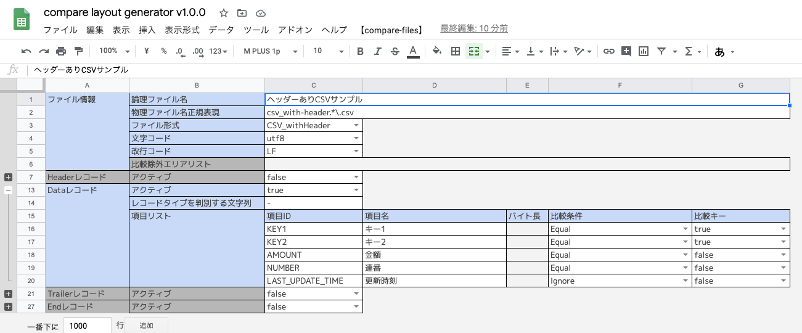
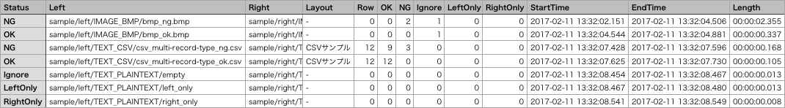
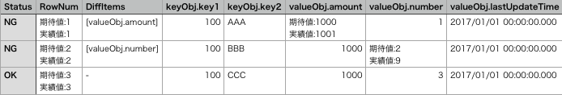

<link href="https://raw.github.com/simonlc/Markdown-CSS/master/markdown.css" rel="stylesheet"></link>

# compare-files

テキスト、画像ファイルを一括比較するコマンドラインツールです。


## 機能

| 機能             | 説明                                                                                                                                                                                                                                                                                        |
|:-----------------|:--------------------------------------------------------------------------------------------------------------------------------------------------------------------------------------------------------------------------------------------------------------------------------------------|
| ファイル比較     | 比較レイアウトに従って、引数で渡された2つのファイルを比較します。 <br/>比較する左右のファイルは、フルパス(or 実行ディレクトリからの相対パス)で指定します。                                                                                                                                  |
| ディレクトリ比較 | 比較レイアウトに従って、引数で渡された2つのディレクトリを、サブディレクトリを含めて比較します。 <br/>比較する左右のディレクトリは、フルパス(or 実行ディレクトリからの相対パス)で指定します。 実際に比較対象となるファイルは、指定ディレクトリからの相対パスが完全一致するものです。         |
| 対象指定比較     | 比較レイアウトに従って、引数で渡された対象指定定義のファイルセットを比較します。 <br/>比較する左右のファイルを左ディレクトリ/右ディレクトリ/ファイル名正規表現(左右共通)で指定します。 実際に比較対象となる右ファイルは、指定ディレクトリ配下で、はじめに正規表現にマッチしたファイルです。 |


### ファイル比較

compare_files に「ファイルパス」を指定して起動します。

- Usage

  ```bash
  bin/compare_files.sh [Options] LEFT_FILE_PATH RIGHT_FILE_PATH
  ```

### ディレクトリ比較

compare_files に「ディレクトリパス」を指定して起動します。

- Usage

  ```bash
  bin/compare_files.sh [Options] LEFT_DIR_PATH RIGHT_DIR_PATH
  ```

### 正規表現指定比較

compare_regex に「比較対象設定ファイルのパス」を指定して起動します。

- Usage

  ```bash
  bin/compare_regex.sh [Options] TARGET_FILE_PATH
  ```

- 比較対象設定ファイル
  - ファイルフォーマット

    | 項目 | 説明 |
    |:-----|:-----|
    | 配置ディレクトリ | 任意 ※起動パラメータで指定します。 |
    | ファイル名 | 任意 ※起動パラメータで指定します。 |
    | ファイル形式 | CSV |
    | -- エスケープ | " |
    | -- コメント   | # |
    | 文字コード | UTF8 |
    | 改行コード | LF |

  - ファイルレイアウト

    | 項目 | 説明 |
    |:-----|:-----|
    | 左ディレクトリ | 比較元(期待値)ファイルを検索するディレクトリを指定します。<br/>指定ディレクトリ直下から対象ファイルを検索します。 |
    | 右ディレクトリ | 比較先(実績値)ファイルを検索するディレクトリを指定します。<br/>指定ディレクトリ直下から対象ファイルを検索します。 |
    | ファイル名正規表現 | 比較元(期待値)、比較先(実績値)ファイル共通の正規表現を指定します。<br/>ディレクトリ内で、はじめにマッチしたファイルが比較対象になります。 |

  - サンプル

    ```csv
    # 左ディレクトリ,右ディレクトリ,ファイル名正規表現
    #
    # ファイル名に、タイムスタンプが含まれる場合
    left,right,csv_with-header_\d{14}.csv
    #
    # ファイル名に、連番が含まれる場合
    left,right,fixed_multi-record-type_\d{4}.txt
    #
    # 固定のファイル名
    left,right,jsonlist_ng.json
    ```

## 設定

### 起動設定

- ファイルフォーマット

  | 項目 | 説明 |
  |:-----|:-----|
  | 配置ディレクトリ | config/ |
  | ファイル名 | compare_files.json |
  | ファイル形式 | json |
  | 文字コード | UTF8 |
  | 改行コード | LF |

- ファイルレイアウト

  | 項目                          | 説明                                                                                                                                                                                                                                                                                                    |
  |:------------------------------|:--------------------------------------------------------------------------------------------------------------------------------------------------------------------------------------------------------------------------------------------------------------------------------------------------------|
  | overwriteLayoutDir            | 上書き比較レイアウトディレクトリ<br/>クラスパスの比較レイアウトを上書きしたい場合、ディレクトリを指定できます。<br/>ディレクトリ直下の全てのファイルを読み込みます。レイアウトは、比較レイアウトを参照してください。                                                                                    |
  | deleteWorkDir                 | 一時ファイルを削除するか?<br/>テキストファイル比較の場合、左右のファイルをソートしてから比較を実施します。<br/>ソート後の、実際に比較するファイルを保持する場合は、falseを指定します。                                                                                                                  |
  | sorted                        | 比較対象ファイルはソート済か?<br/>テキストファイル比較のソートをスキップして比較を実施します。<br/>左右のファイルが同じ条件でソートされている場合、高速化が見込めます。                                                                                                                                 |
  | csvHeaderRow                  | 何行目を゙ヘッダー行として扱うか<br/>ヘッダー付きCSV/TSVの比較時に利用されます。                                                                                                                                                                                                                          |
  | csvDataStartRow               | 何行目からデータが始まるか<br/>ヘッダー付きCSV/TSVの比較時に利用されます。                                                                                                                                                                                                                              |
  | codeValueForOnlyOneRecordType | レコードタイプが1つのみの場合に設定する、レコードタイプの判別文字列<br/>固定長テキストの比較時に利用されます。<br/>「レコードタイプを判別する文字列」が対象ファイルに出力されない場合など、1種類のレコードタイプを強制的に利用したい 場合は、この値のレコードタイプを比較レイアウトに記載してください。 |
  | outputDir                     | 結果ファイル出力ディレクトリ                                                                                                                                                                                                                                                                            |
  | outputCharset                 | 結果ファイル文字コード                                                                                                                                                                                                                                                                                  |
  | compareResultFileName         | 一括比較結果ファイル名<br/>ディレクトリ比較、正規表現指定比較を実施した場合に出力されます。                                                                                                                                                                                                             |
  | compareDetailFilePrefix       | ファイル比較結果ファイル名プリフィックス<br/>テキストファイル比較：{プリフィックス}_{右ファイル名}_{右ディレクトリ}.csv<br/>画像ファイル比較：{プリフィックス}_{右ファイル名}_{右ディレクトリ}.png                                                                                                      |
  | writeDiffOnly                 | 結果ファイルに出力する内容を、差分のみにするか？<br/>比較結果がOKの場合、ファイルに出力されなくなります。                                                                                                                                                                                               |
  | leftPrefix                    | 結果ファイルに出力する左ファイルプリフィックス                                                                                                                                                                                                                                                          |
  | rightPrefix                   | 結果ファイルに出力する右ファイルプリフィックス                                                                                                                                                                                                                                                          |
  | chunkSize                     | 結果ファイルの出力バッファ行数<br/>実行環境のメモリに応じたバッファ行数を指定することで高速化が見込めます。                                                                                                                                                                                             |
  | ignoreFileRegexList           | 一括比較時に除外するファイル名正規表現リスト<br/>ドットで始まるファイルなど共通で比較を除外したいファイル名を正規表現のリストで指定できます。                                                                                                                                                           |
  | ignoreItemList                | テキストファイル比較時に、比較を除外する項目IDリスト                                                                                                                                                                                                                                                    |
  | ignoreAreaList                | 画像ファイル比較時に、比較を除外するエリアリスト<br/>x, y, width, height をJsonオブジェクトで指定します。                                                                                                                                                                                               |
  | okImageStyle                  | 画像ファイル比較結果がOKの場合のスタイル<br/>ラベルの色や、ボーダー、背景色を指定できます。詳細はサンプルを参照してください。                                                                                                                                                                           |
  | ngImageStyle                  | 画像ファイル比較結果がNGの場合のスタイル<br/>ラベルの色や、ボーダー、背景色を指定できます。詳細はサンプルを参照してください。                                                                                                                                                                           |


- サンプル

  ```json
  {
      "overwriteLayoutDir" : "",
      "deleteWorkDir" : "true",
      "sorted" : "false",
      "csvHeaderRow" : 1,
      "csvDataStartRow" : 2,
      "codeValueForOnlyOneRecordType":"-",
      "outputDir" : "result",
      "outputCharset" : "utf8",
      "compareResultFileName" : "CompareSummary.csv",
      "compareDetailFilePrefix" : "CompareDetail_",
      "writeDiffOnly" : "false",
      "leftPrefix" : "期待値:",
      "rightPrefix" : "実績値:",
      "chunkSize" : 1000,
      "ignoreFileRegexList" : ["^\\..*"],
      "ignoreItemList" : ["last_update_time", "LAST_UPDATE_TIME"],
      "ignoreAreaList" : [{"x": 0, "y":0, "width":1024, "height":128}],
      "okImageStyle": {
        "border": 4,
        "labelFontSize": 24,
        "labelHeight": 36,
        "labelPaddingLeft": 12,
        "labelPaddingTop": 28,
        "labelColor":   {"r": 255, "g": 255, "b": 255, "a": 200},
        "leftBgColor":  {"r": 52,  "g": 152, "b": 219, "a": 255},
        "rightBgColor": {"r": 26,  "g": 188, "b": 156, "a": 255}
      },
      "ngImageStyle": {
        "border": 4,
        "labelFontSize": 24,
        "labelHeight": 36,
        "labelPaddingLeft": 12,
        "labelPaddingTop": 28,
        "labelColor":   {"r": 255, "g": 255, "b": 255, "a": 200},
        "leftBgColor":  {"r": 52,  "g": 152, "b": 219, "a": 255},
        "rightBgColor": {"r": 231, "g": 76,  "b": 60,  "a": 255}
      }
  }
  ```

### 比較レイアウト

- ファイルフォーマット

  | 項目 | 説明 |
  |:-----|:-----|
  | 配置ディレクトリ | config/compare_layout/ |
  | ファイル名 | 任意 |
  | ファイル形式 | json |
  | 文字コード | UTF8 |
  | 改行コード | LF |

- ファイルレイアウト

  | 階層 | 項目 | 説明 |
  |:-----|:-----|:-----|
  | ファイル情報 | logicalFileName | 論理ファイル名 |
  || fileRegexPattern | 物理ファイル名正規表現 |
  || fileFormat | ファイル形式<br/>CSV_noHeader/CSV_withHeader/TSV_noHeader/TSV_withHeader/Json/JsonList/Fixed/Text/Image |
  || charset | 文字コード<br/>テキストファイル比較時に利用されます。 |
  || lineSp | 改行コード<br/>CR/LF/CRLF/None<br/>テキストファイル比較時に利用されます。 |
  || ignoreAreaList | 比較除外エリアリスト<br/> x, y, width, height を jsonオブジェクトで指定します。<br/>画像ファイル比較時に利用されます。 |
  | テキストファイル.レコード情報 | type | レコードタイプ<br/>Header/Data/Trailer/End |
  || codeValue | レコードタイプを判別する文字列<br/>※例：Header=0, Data=1, Trailer=8, End=9 |
  | テキストファイル.レコード.項目情報 | id | 項目ID<br/>※比較結果には、この値が出力されます。 |
  || name | 項目名 |
  || byteLength | バイト長 |
  || criteria | 比較条件 ※詳細は、後述を参照してください。 |
  || compareKey | 対象行を選択する比較キーとして利用する場合にtrueを設定します。 |

- サンプル

  ```json
  {
    "layoutList": [
      {
        "logicalFileName":  "ヘッダーありCSVサンプル",
        "fileRegexPattern": "csv_with-header.*\\.csv",
        "fileFormat":       "CSV_withHeader",
        "charset":          "utf8",
        "lineSp":           "LF",
        "recordList": [
          {
            "type": "Data", "codeValue": "-", "itemList": [
              { "id": "KEY1",             "name": "キー1",    "byteLength": 3,   "criteria": "Equal", "compareKey": "true" },
              { "id": "KEY2",             "name": "キー2",    "byteLength": 3,   "criteria": "Equal", "compareKey": "true" },
              { "id": "AMOUNT",           "name": "金額",     "byteLength": 100, "criteria": "Equal", "compareKey": "false" },
              { "id": "NUMBER",           "name": "連番",     "byteLength": 20,  "criteria": "Equal", "compareKey": "false" },
              { "id": "LAST_UPDATE_TIME", "name": "更新時刻", "byteLength": 19,  "criteria": "Equal", "compareKey": "false" }
            ]
          }
        ]
      },

      {
        "logicalFileName":  "固定長テキストサンプル",
        "fileRegexPattern": "fixed_multi-record-type.*\\.txt",
        "fileFormat":       "Fixed",
        "charset":          "utf8",
        "lineSp":           "LF",
        "recordList": [
          {
            "type": "Header", "codeValue": "0", "itemList": [
              { "id": "RECORD_TYPE", "name": "レコードタイプ",     "byteLength": 1,  "criteria": "Equal", "compareKey": "true"  },
              { "id": "DATA_COUNT",  "name": "データレコード件数", "byteLength": 10, "criteria": "Equal", "compareKey": "false" },
              { "id": "BLANK",       "name": "予備",               "byteLength": 39, "criteria": "Equal", "compareKey": "false" }
            ]
          },
          {
            "type": "Data", "codeValue": "1", "itemList": [
              { "id": "RECORD_TYPE",  "name": "レコードタイプ", "byteLength": 1,  "criteria": "Equal", "compareKey": "true" },
              { "id": "KEY1",         "name": "キー1",          "byteLength": 3,  "criteria": "Equal", "compareKey": "true" },
              { "id": "KEY2",         "name": "キー2",          "byteLength": 3,  "criteria": "Equal", "compareKey": "true" },
              { "id": "AMOUNT",       "name": "金額",           "byteLength": 10, "criteria": "Equal", "compareKey": "false" },
              { "id": "BLANK",        "name": "予備",           "byteLength": 33, "criteria": "Equal", "compareKey": "false" }
            ]
          },
          {
            "type": "Trailer", "codeValue": "2", "itemList": [
              { "id": "RECORD_TYPE", "name": "レコードタイプ", "byteLength": 1,  "criteria": "Equal", "compareKey": "true" },
              { "id": "SUM_AMOUNT", "name": "合計金額",        "byteLength": 14, "criteria": "Equal", "compareKey": "false" },
              { "id": "AVE_AMOUNT", "name": "平均金額",        "byteLength": 10, "criteria": "Equal", "compareKey": "false" },
              { "id": "MIN_AMOUNT", "name": "最少金額",        "byteLength": 10, "criteria": "Equal", "compareKey": "false" },
              { "id": "MAX_AMOUNT", "name": "最大金額",        "byteLength": 10, "criteria": "Equal", "compareKey": "false" },
              { "id": "BLANK",      "name": "予備",            "byteLength": 5,  "criteria": "Equal", "compareKey": "false" }
            ]
          },
          {
            "type": "End", "codeValue": "9", "itemList": [
              { "id": "RECORD_TYPE", "name": "レコードタイプ", "byteLength": 1,   "criteria": "Equal", "compareKey": "true" },
              { "id": "STATUS",      "name": "処理ステータス", "byteLength": 1,   "criteria": "Equal", "compareKey": "false" },
              { "id": "BLANK",       "name": "予備",           "byteLength": 48,  "criteria": "Equal", "compareKey": "false" }
            ]
          }
        ]
      },

      {
        "logicalFileName":  "JsonListサンプル",
        "fileRegexPattern": "jsonlist_.*\\.json",
        "fileFormat":       "JsonList",
        "charset":          "utf8",
        "lineSp":           "LF",
        "recordList": [
          {
            "type": "Data", "codeValue": "-", "itemList": [
              { "id": "keyObj.key1",             "name": "キー1",    "byteLength": 3,   "criteria": "Equal",                         "compareKey": "true" },
              { "id": "keyObj.key2",             "name": "キー2",    "byteLength": 3,   "criteria": "Equal",                         "compareKey": "true" },
              { "id": "valueObj.amount",         "name": "金額",     "byteLength": 100, "criteria": "Equal",                         "compareKey": "false" },
              { "id": "valueObj.number",         "name": "連番",     "byteLength": 20,  "criteria": "Equal",                         "compareKey": "false" },
              { "id": "valueObj.lastUpdateTime", "name": "更新時刻", "byteLength": 19,  "criteria": "Datetime_GraterEqualThan_Left", "compareKey": "false" }
            ]
          }
        ]
      },

      {
        "logicalFileName":  "PNGサンプル",
        "fileRegexPattern": "png.*\\.png",
        "fileFormat":       "Image",
        "ignoreAreaList" : [
          {"x": 256, "y":452, "width":120, "height":60}
        ]
      }

    ]
  }
  ```

#### 比較条件

比較レイアウトで指定できる条件です。 左右の値を比較して、下記の条件にマッチする場合に「比較結果=OK」と判断します。

- 条件一覧

  | コード                      | 比較内容                                                                                                                    |
  |:----------------------------|:----------------------------------------------------------------------------------------------------------------------------|
  | Ignore                      | 比較を除外。                                                                                                                |
  | Equal                       | 文字列としての比較結果が、一致の場合、OKと判断。                                                                            |
  | NotEqual                    | 文字列としての比較結果が、不一致の場合、OKと判断。                                                                          |
  | Number_GraterEqualThan_Left   | 数値としての比較結果が、左以上の場合、OKと判断。                                                                            |
  | Number_GraterThan_Left        | 数値としての比較結果が、左より大きい場合、OKと判断。                                                                        |
  | Number_LessEqualThan_Left     | 数値としての比較結果が、左以下の場合、OKと判断。                                                                            |
  | Number_LessThan_Left          | 数値としての比較結果が、左より小さい場合、OKと判断。                                                                        |
  | Year_GraterEqualThan_Left     | 年(yyyy)としての比較結果が、左以上の場合、OKと判断。                                                                        |
  | Year_GraterThan_Left          | 年(yyyy)としての比較結果が、左より大きい場合、OKと判断。                                                                    |
  | Year_LessEqualThan_Left       | 年(yyyy)としての比較結果が、左以下の場合、OKと判断。                                                                        |
  | Year_LessThan_Left            | 年(yyyy)としての比較結果が、左より小さい場合、OKと判断。                                                                    |
  | Month_GraterEqualThan_Left    | 年月(yyyyMM)としての比較結果が、左以上の場合、OKと判断。                                                                    |
  | Month_GraterThan_Left         | 年月(yyyyMM)としての比較結果が、左より大きい場合、OKと判断。                                                                |
  | Month_LessEqualThan_Left      | 年月(yyyyMM)としての比較結果が、左以上の場合、OKと判断。                                                                    |
  | Month_LessThan_Left           | 年月(yyyyMM)としての比較結果が、左より小さい場合、OKと判断。                                                                |
  | Date_GraterEqualThan_Left     | 年月日(yyyyMMdd, yyyy-MM-dd, yyyy/MM/dd)としての比較結果が、左以上の場合、OKと判断。                                        |
  | Date_GraterThan_Left          | 年月日(yyyyMMdd, yyyy-MM-dd, yyyy/MM/dd)としての比較結果が、左より大きい場合、OKと判断。                                    |
  | Date_LessEqualThan_Left       | 年月日(yyyyMMdd, yyyy-MM-dd, yyyy/MM/dd)としての比較結果が、左以下の場合、OKと判断。                                        |
  | Date_LessThan_Left            | 年月日(yyyyMMdd, yyyy-MM-dd, yyyy/MM/dd)としての比較結果が、左より小さい場合、OKと判断。                                    |
  | Datetime_GraterEqualThan_Left | 年月日時分秒(yyyyMMddHHmmss, yyyy-MM-dd HH:mm:ss, yyyy/MM/dd HH:mm:ss etc)としての比較結果が、左以上の 場合、OKと判断。     |
  | Datetime_GraterThan_Left      | 年月日時分秒(yyyyMMddHHmmss, yyyy-MM-dd HH:mm:ss, yyyy/MM/dd HH:mm:ss etc)としての比較結果が、左より大 きい場合、OKと判断。 |
  | Datetime_LessEqualThan_Left   | 年月日時分秒(yyyyMMddHHmmss, yyyy-MM-dd HH:mm:ss, yyyy/MM/dd HH:mm:ss etc)としての比較結果が、左以下の 場合、OKと判断。     |
  | Datetime_LessThan_Left        | 年月日時分秒(yyyyMMddHHmmss, yyyy-MM-dd HH:mm:ss, yyyy/MM/dd HH:mm:ss etc)としての比較結果が、左より小 さい場合、OKと判断。 |


#### generator

レイアウトの作成を補助するgoogle sheetsを用意しています。



##### 利用方法

- [generator](https://docs.google.com/spreadsheets/d/1pZ7Ta75L5zM8JshsTG9axp0QXs3WG6Xxy1N81JhF11M/copy) をマイドライブにコピー
- `__tmpl__` シートをコピーして、レイアウトを記載
  - ファイル形式や、レコードタイプの有無で、指定が必要な項目が異なります
  - 指定が不要な項目は、グレーアウトされます
- `【compare-files】`メニュー → `generate layout` をクリック
- `__generated__` シートの内容を、前述のファイルフォーマットに従って配置


## 結果

### 一括比較結果

- ファイルフォーマット

  | 項目 | 説明 |
  |:-----|:-----|
  | 配置ディレクトリ | result/ ※起動設定で変更できます。 |
  | ファイル名 | CompareSummary.csv ※起動設定で変更できます。 |
  | ファイル形式 | csv |
  | 文字コード | UTF8 ※起動設定で変更できます。 |
  | 改行コード | LF ※システムデフォルト |

- ファイルレイアウト

  | 項目 | 説明 |
  |:-----|:-----|
  | Status        | 比較ステータス<br/>OK / NG / Ignore / LeftOnly / RightOnly / Error |
  | Left          | 左ファイルパス |
  | Right         | 右ファイルパス |
  | Layout        | 比較レイアウト<br/>レイアウトが適用されなかった場合「-」 |
  | Row           | テキストファイル比較：比較した行数<br/>画像ファイル比較：0 固定 |
  | OK Row        | テキストファイル比較：OKの行数<br/>画像ファイル比較：0 固定 |
  | NG Row        | テキストファイル比較：NGの行数<br/>画像ファイル比較：NGのエリア数 |
  | Ignore Row    | テキストファイル比較：除外した行数<br/>画像ファイル比較：除外したエリア数 |
  | LeftOnly Row  | テキストファイル比較：左のみに存在する行数<br/>画像ファイル比較：0 固定 |
  | RightOnly Row | テキストファイル比較：右のみに存在する行数<br/>画像ファイル比較：0 固定 |
  | StartTime     | 比較開始時刻 |
  | EndTime       | 比較終了時刻 |
  | Length        | 比較処理時間 |

- サンプル

  


### テキストファイル比較結果

- ファイルフォーマット

  | 項目 | 説明 |
  |:-----|:-----|
  | 配置ディレクトリ | result/ ※起動設定で変更できます。 |
  | ファイル名 | CompareDetail_{右ファイル名}_{右ディレクトリ}.csv ※起動設定でプリフィックスを変更できます。 |
  | ファイル形式 | csv |
  | 文字コード | UTF8 ※起動設定で変更できます。 |
  | 改行コード | LF ※システムデフォルト |

- ファイルレイアウト

  | 項目 | 説明 |
  |:-----|:-----|
  | Status | 比較ステータス<br/>OK / NG / Ignore / LeftOnly / RightOnly / Error |
  | RowNum | 比較した左右の行番号 |
  | DiffItems | 差分を検出した項目IDリスト |
  | 比較レイアウトの項目群 | 比較レイアウトで定義した項目を、定義順に全て出力します。<br/>レコードタイプが複数ある場合「レコードタイプ.項目ID」で全ての項目を列挙<br/>ファイル形式=Textの場合「value」の一項目に行全体を出力 |

- サンプル

  


### 画像ファイル比較結果

- ファイルフォーマット

  | 項目 | 説明 |
  |:-----|:-----|
  | 配置ディレクトリ | result/ ※起動設定で変更できます。 |
  | ファイル名 | CompareDetail_{右ファイル名}_{右ディレクトリ}.png ※起動設定でプリフィックスを変更できます。 |
  | ファイル形式 | png |

- サンプル
  - OK
    

  - NG
    


## Tips

### テキスト比較

- ソートの挙動
下記のレイアウトの場合、内部的なソートは実施しません。出力行にずれがある場合、ずれたままの比較結果になるのでご注意ください。
  - 比較レイアウトなし
  - fileFormat = Text
  - fileFormat = Json
  - fileFormat = Fixed & lineSp = None


### 共通

- クラスパスの環境変数指定  
デフォルトの挙動は、 config/ ディレクトリ配下の設定ファイルで設定できます。  
config/ ディレクトリは、Javaのclasspathを通してあるため、これが利用されています。  
動的にデフォルトの挙動を変更する場合は、環境変数「COMPAREFILES_CLASSPATH」で上書きできます。  
  ```bash
  export COMPAREFILES_CLASSPATH="/path/to/dynamic_config"
  ```

- 起動パラメータの環境変数指定  
デフォルトでは、起動パラメータは指定されません。  
共通で起動パラメータを設定したい場合は、環境変数「COMPAREFILES_JAVA_OPT」で設定できます。  
  ```bash
  export COMPAREFILES_JAVA_OPT="-od /path/to/output -oc ms932"
  ```


## Contact

- [要望を伝える](https://github.com/scenario-test-framework/compare-files/issues?q=is%3Aopen+is%3Aissue+label%3Aenhancement)
- [バグを報告する](https://github.com/scenario-test-framework/compare-files/issues?q=is%3Aopen+is%3Aissue+label%3Abug)
- [質問する](https://github.com/scenario-test-framework/compare-files/issues?q=is%3Aopen+is%3Aissue+label%3Aquestion)
- [その他](mailto:suwash01@gmail.com)


## ライセンス
[Apache License, Version 2.0](http://www.apache.org/licenses/LICENSE-2.0)
