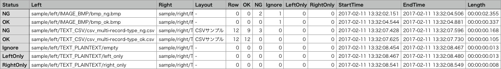
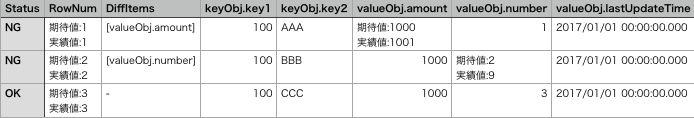
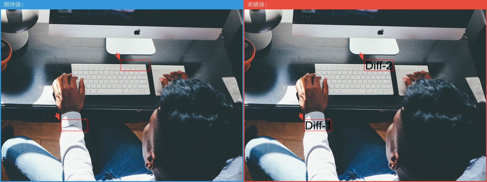

<link href="https://raw.github.com/simonlc/Markdown-CSS/master/markdown.css" rel="stylesheet"></link>

# compare-files

[](https://github.com/scenario-test-framework/compare-files/actions/workflows/docker-publish.yml)
[](https://github.com/scenario-test-framework/compare-files/releases/latest)
[](LICENSE)

テキスト、画像ファイルを一括比較するコマンドラインツールです。

Go 製のシングルバイナリで動作します (v2 で Java から移植)。
CLI 引数・設定ファイル・比較レイアウト・結果 CSV・終了コードは Java 版 (v1.x) と互換です。


## 機能

| 機能             | 説明                                                                                                                                                                                                                                                                                        |
|:-----------------|:--------------------------------------------------------------------------------------------------------------------------------------------------------------------------------------------------------------------------------------------------------------------------------------------|
| ファイル比較     | 比較レイアウトに従って、引数で渡された2つのファイルを比較します。 <br/>比較する左右のファイルは、フルパス(or 実行ディレクトリからの相対パス)で指定します。                                                                                                                                  |
| ディレクトリ比較 | 比較レイアウトに従って、引数で渡された2つのディレクトリを、サブディレクトリを含めて比較します。 <br/>比較する左右のディレクトリは、フルパス(or 実行ディレクトリからの相対パス)で指定します。 実際に比較対象となるファイルは、指定ディレクトリからの相対パスが完全一致するものです。         |
| 対象指定比較     | 比較レイアウトに従って、引数で渡された対象指定定義のファイルセットを比較します。 <br/>比較する左右のファイルを左ディレクトリ/右ディレクトリ/ファイル名正規表現(左右共通)で指定します。 実際に比較対象となる右ファイルは、指定ディレクトリ配下で、はじめに正規表現にマッチしたファイルです。 |


### ファイル比較

compare_files に「ファイルパス」を指定して起動します。

- Usage

  ```bash
  bin/compare_files.sh [Options] LEFT_FILE_PATH RIGHT_FILE_PATH
  ```

### ディレクトリ比較

compare_files に「ディレクトリパス」を指定して起動します。

- Usage

  ```bash
  bin/compare_files.sh [Options] LEFT_DIR_PATH RIGHT_DIR_PATH
  ```

### 正規表現指定比較

compare_regex に「比較対象設定ファイルのパス」を指定して起動します。

- Usage

  ```bash
  bin/compare_regex.sh [Options] TARGET_FILE_PATH
  ```

- 比較対象設定ファイル
  - ファイルフォーマット

    | 項目 | 説明 |
    |:-----|:-----|
    | 配置ディレクトリ | 任意 ※起動パラメータで指定します。 |
    | ファイル名 | 任意 ※起動パラメータで指定します。 |
    | ファイル形式 | CSV |
    | -- エスケープ | " |
    | -- コメント   | # |
    | 文字コード | UTF8 |
    | 改行コード | LF |

  - ファイルレイアウト

    | 項目 | 説明 |
    |:-----|:-----|
    | 左ディレクトリ | 比較元(期待値)ファイルを検索するディレクトリを指定します。<br/>指定ディレクトリ直下から対象ファイルを検索します。 |
    | 右ディレクトリ | 比較先(実績値)ファイルを検索するディレクトリを指定します。<br/>指定ディレクトリ直下から対象ファイルを検索します。 |
    | ファイル名正規表現 | 比較元(期待値)、比較先(実績値)ファイル共通の正規表現を指定します。<br/>ディレクトリ内で、はじめにマッチしたファイルが比較対象になります。 |

  - サンプル

    ```csv
    # 左ディレクトリ,右ディレクトリ,ファイル名正規表現
    #
    # ファイル名に、タイムスタンプが含まれる場合
    left,right,csv_with-header_\d{14}.csv
    #
    # ファイル名に、連番が含まれる場合
    left,right,fixed_multi-record-type_\d{4}.txt
    #
    # 固定のファイル名
    left,right,jsonlist_ng.json
    ```

## 設定

### 起動設定

- ファイルフォーマット

  | 項目 | 説明 |
  |:-----|:-----|
  | 配置ディレクトリ | config/ |
  | ファイル名 | compare_files.json ※なければ compare_files.yaml → compare_files.yml の順で探索します。 |
  | ファイル形式 | json / yaml ※yaml はコメントを記載できます。`-config` オプションは拡張子で形式を判定します。 |
  | 文字コード | UTF8 |
  | 改行コード | LF |

- ファイルレイアウト

  | 項目                          | 説明                                                                                                                                                                                                                                                                                                    |
  |:------------------------------|:--------------------------------------------------------------------------------------------------------------------------------------------------------------------------------------------------------------------------------------------------------------------------------------------------------|
  | overwriteLayoutDir            | 上書き比較レイアウトディレクトリ<br/>クラスパスの比較レイアウトを上書きしたい場合、ディレクトリを指定できます。<br/>ディレクトリ直下の全てのファイルを読み込みます。レイアウトは、比較レイアウトを参照してください。                                                                                    |
  | deleteWorkDir                 | 一時ファイルを削除するか?<br/>テキストファイル比較の場合、左右のファイルをソートしてから比較を実施します。<br/>ソート後の、実際に比較するファイルを保持する場合は、falseを指定します。                                                                                                                  |
  | sorted                        | 比較対象ファイルはソート済か?<br/>テキストファイル比較のソートをスキップして比較を実施します。<br/>左右のファイルが同じ条件でソートされている場合、高速化が見込めます。                                                                                                                                 |
  | csvHeaderRow                  | 何行目を゙ヘッダー行として扱うか<br/>ヘッダー付きCSV/TSVの比較時に利用されます。                                                                                                                                                                                                                          |
  | csvDataStartRow               | 何行目からデータが始まるか<br/>ヘッダー付きCSV/TSVの比較時に利用されます。                                                                                                                                                                                                                              |
  | codeValueForOnlyOneRecordType | レコードタイプが1つのみの場合に設定する、レコードタイプの判別文字列<br/>固定長テキストの比較時に利用されます。<br/>「レコードタイプを判別する文字列」が対象ファイルに出力されない場合など、1種類のレコードタイプを強制的に利用したい 場合は、この値のレコードタイプを比較レイアウトに記載してください。 |
  | outputDir                     | 結果ファイル出力ディレクトリ                                                                                                                                                                                                                                                                            |
  | outputCharset                 | 結果ファイル文字コード                                                                                                                                                                                                                                                                                  |
  | compareResultFileName         | 一括比較結果ファイル名<br/>ディレクトリ比較、正規表現指定比較を実施した場合に出力されます。                                                                                                                                                                                                             |
  | compareDetailFilePrefix       | ファイル比較結果ファイル名プリフィックス<br/>テキストファイル比較：{プリフィックス}_{右ファイル名}_{右ディレクトリ}.csv<br/>画像ファイル比較：{プリフィックス}_{右ファイル名}_{右ディレクトリ}.png                                                                                                      |
  | writeDiffOnly                 | 結果ファイルに出力する内容を、差分のみにするか？<br/>比較結果がOKの場合、ファイルに出力されなくなります。                                                                                                                                                                                               |
  | leftPrefix                    | 結果ファイルに出力する左ファイルプリフィックス                                                                                                                                                                                                                                                          |
  | rightPrefix                   | 結果ファイルに出力する右ファイルプリフィックス                                                                                                                                                                                                                                                          |
  | chunkSize                     | 結果ファイルの出力バッファ行数<br/>実行環境のメモリに応じたバッファ行数を指定することで高速化が見込めます。                                                                                                                                                                                             |
  | ignoreFileRegexList           | 一括比較時に除外するファイル名正規表現リスト<br/>ドットで始まるファイルなど共通で比較を除外したいファイル名を正規表現のリストで指定できます。                                                                                                                                                           |
  | ignoreItemList                | テキストファイル比較時に、比較を除外する項目IDリスト                                                                                                                                                                                                                                                    |
  | ignoreAreaList                | 画像ファイル比較時に、比較を除外するエリアリスト<br/>x, y, width, height をJsonオブジェクトで指定します。                                                                                                                                                                                               |
  | okImageStyle                  | 画像ファイル比較結果がOKの場合のスタイル<br/>ラベルの色や、ボーダー、背景色を指定できます。詳細はサンプルを参照してください。                                                                                                                                                                           |
  | ngImageStyle                  | 画像ファイル比較結果がNGの場合のスタイル<br/>ラベルの色や、ボーダー、背景色を指定できます。詳細はサンプルを参照してください。                                                                                                                                                                           |


- サンプル

  ```json
  {
      "overwriteLayoutDir" : "",
      "deleteWorkDir" : "true",
      "sorted" : "false",
      "csvHeaderRow" : 1,
      "csvDataStartRow" : 2,
      "codeValueForOnlyOneRecordType":"-",
      "outputDir" : "result",
      "outputCharset" : "utf8",
      "compareResultFileName" : "CompareSummary.csv",
      "compareDetailFilePrefix" : "CompareDetail_",
      "writeDiffOnly" : "false",
      "leftPrefix" : "期待値:",
      "rightPrefix" : "実績値:",
      "chunkSize" : 1000,
      "ignoreFileRegexList" : ["^\\..*"],
      "ignoreItemList" : ["last_update_time", "LAST_UPDATE_TIME"],
      "ignoreAreaList" : [{"x": 0, "y":0, "width":1024, "height":128}],
      "okImageStyle": {
        "border": 4,
        "labelFontSize": 24,
        "labelHeight": 36,
        "labelPaddingLeft": 12,
        "labelPaddingTop": 28,
        "labelColor":   {"r": 255, "g": 255, "b": 255, "a": 200},
        "leftBgColor":  {"r": 52,  "g": 152, "b": 219, "a": 255},
        "rightBgColor": {"r": 26,  "g": 188, "b": 156, "a": 255}
      },
      "ngImageStyle": {
        "border": 4,
        "labelFontSize": 24,
        "labelHeight": 36,
        "labelPaddingLeft": 12,
        "labelPaddingTop": 28,
        "labelColor":   {"r": 255, "g": 255, "b": 255, "a": 200},
        "leftBgColor":  {"r": 52,  "g": 152, "b": 219, "a": 255},
        "rightBgColor": {"r": 231, "g": 76,  "b": 60,  "a": 255}
      }
  }
  ```

- 階層化形式

  フラット形式に加えて、利用目的ごとに階層化した形式でも記載できます (json / yaml どちらでも可)。
  同じ設定をフラット形式と階層化形式の両方で指定した場合は、階層化形式が優先されます。
  グループ内のキーは、下表の簡潔な別名に加えて従来のフラットキー名 (`input.defaultInputCharset` など) も利用できます。

  | 階層化キー | フラットキー |
  |:-----------|:-------------|
  | input.leftFilePath | leftFilePath |
  | input.rightFilePath | rightFilePath |
  | input.defaultCharset | defaultInputCharset |
  | input.ignoreFileRegexList | ignoreFileRegexList |
  | compare.sorted | sorted |
  | compare.chunkSize | chunkSize |
  | compare.ignoreItemList | ignoreItemList |
  | compare.layoutDir | overwriteLayoutDir |
  | compare.csv.headerRow | csvHeaderRow |
  | compare.csv.dataStartRow | csvDataStartRow |
  | compare.fixed.codeValueForOnlyOneRecordType | codeValueForOnlyOneRecordType |
  | compare.image.ignoreAreaList | ignoreAreaList |
  | compare.image.okStyle | okImageStyle |
  | compare.image.ngStyle | ngImageStyle |
  | output.dir | outputDir |
  | output.charset | outputCharset |
  | output.resultFileName | compareResultFileName |
  | output.detailFilePrefix | compareDetailFilePrefix |
  | output.writeDiffOnly | writeDiffOnly |
  | output.leftPrefix | leftPrefix |
  | output.rightPrefix | rightPrefix |
  | output.deleteWorkDir | deleteWorkDir |

  yaml + 階層化形式のサンプル (compare_files.yaml):

  ```yaml
  # 入力ファイルの読み込み設定
  input:
    ignoreFileRegexList:
      - "^\\..*"

  # 比較処理の設定
  compare:
    sorted: false
    chunkSize: 1000
    ignoreItemList:
      - last_update_time
      - LAST_UPDATE_TIME
    csv:
      headerRow: 1      # 何行目をヘッダー行として扱うか
      dataStartRow: 2   # 何行目からデータが始まるか
    fixed:
      codeValueForOnlyOneRecordType: "-"
    image:
      ignoreAreaList:
        - {x: 0, y: 0, width: 1024, height: 128}

  # 比較結果の出力設定
  output:
    dir: result
    charset: utf8
    resultFileName: CompareSummary.csv
    detailFilePrefix: CompareDetail_
    writeDiffOnly: false
    leftPrefix: "期待値:"
    rightPrefix: "実績値:"
    deleteWorkDir: true
  ```

### 進捗ログのメッセージ上書き

進捗ログ・終了メッセージなどの文言は、メッセージ定義ファイルを配置すると上書きできます。

- ファイル名: `compare_files_messages.properties`
- 探索ディレクトリ: `COMPAREFILES_CLASSPATH` → カレントディレクトリ → `config/` (前勝ち)
- 形式: 1 行 1 定義の `キー=値` (UTF-8)。`#` / `!` 始まりはコメント。`\n` `\t` `\\` のエスケープに対応。

```properties
# 例: ファイル走査の進捗ログを英語化する
log.dir.scan=- Scanning files
log.file.compare=  - Compare left:{0} right:{1}
```

メッセージキーの一覧は [internal/msg/msg.go](internal/msg/msg.go) を参照してください
(進捗ログは `log.*`、終了メッセージは `exit.*`)。

### 比較レイアウト

ファイル名の正規表現にマッチしたレイアウト定義 (JSON) に従って、ファイルを項目単位で比較します。
CSV/TSV (ヘッダーあり・なし)、固定長テキスト、JSON/JsonList、画像に対応し、
項目ごとに比較キー・比較条件 (一致 / 除外 / 数値・日付の大小比較など) を指定できます。

- 配置ディレクトリ: `config/compare_layout/` (`-layout` オプションで追加ディレクトリを指定可能)
- **仕様の詳細: [比較レイアウトリファレンス](docs/compare_layout.md)**
- 作成の支援:
  - Claude Code の [`compare-layout` スキル](.claude/skills/compare-layout/) — 比較対象ファイルの実物からレイアウトを生成
  - [Google Sheets generator](https://docs.google.com/spreadsheets/d/1pZ7Ta75L5zM8JshsTG9axp0QXs3WG6Xxy1N81JhF11M/copy) — スプレッドシートから生成
- 検証: `compare_files --lintLayout <layout.json>` でレイアウト定義を検証できます

## 結果

### 一括比較結果

- ファイルフォーマット

  | 項目 | 説明 |
  |:-----|:-----|
  | 配置ディレクトリ | result/ ※起動設定で変更できます。 |
  | ファイル名 | CompareSummary.csv ※起動設定で変更できます。 |
  | ファイル形式 | csv |
  | 文字コード | UTF8 ※起動設定で変更できます。 |
  | 改行コード | LF ※システムデフォルト |

- ファイルレイアウト

  | 項目 | 説明 |
  |:-----|:-----|
  | Status        | 比較ステータス<br/>OK / NG / Ignore / LeftOnly / RightOnly / Error |
  | Left          | 左ファイルパス |
  | Right         | 右ファイルパス |
  | Layout        | 比較レイアウト<br/>レイアウトが適用されなかった場合「-」 |
  | Row           | テキストファイル比較：比較した行数<br/>画像ファイル比較：0 固定 |
  | OK Row        | テキストファイル比較：OKの行数<br/>画像ファイル比較：0 固定 |
  | NG Row        | テキストファイル比較：NGの行数<br/>画像ファイル比較：NGのエリア数 |
  | Ignore Row    | テキストファイル比較：除外した行数<br/>画像ファイル比較：除外したエリア数 |
  | LeftOnly Row  | テキストファイル比較：左のみに存在する行数<br/>画像ファイル比較：0 固定 |
  | RightOnly Row | テキストファイル比較：右のみに存在する行数<br/>画像ファイル比較：0 固定 |
  | StartTime     | 比較開始時刻 |
  | EndTime       | 比較終了時刻 |
  | Length        | 比較処理時間 |

- サンプル

  


### テキストファイル比較結果

- ファイルフォーマット

  | 項目 | 説明 |
  |:-----|:-----|
  | 配置ディレクトリ | result/ ※起動設定で変更できます。 |
  | ファイル名 | CompareDetail_{右ファイル名}_{右ディレクトリ}.csv ※起動設定でプリフィックスを変更できます。 |
  | ファイル形式 | csv |
  | 文字コード | UTF8 ※起動設定で変更できます。 |
  | 改行コード | LF ※システムデフォルト |

- ファイルレイアウト

  | 項目 | 説明 |
  |:-----|:-----|
  | Status | 比較ステータス<br/>OK / NG / Ignore / LeftOnly / RightOnly / Error |
  | RowNum | 比較した左右の行番号 |
  | DiffItems | 差分を検出した項目IDリスト |
  | 比較レイアウトの項目群 | 比較レイアウトで定義した項目を、定義順に全て出力します。<br/>レコードタイプが複数ある場合「レコードタイプ.項目ID」で全ての項目を列挙<br/>ファイル形式=Textの場合「value」の一項目に行全体を出力 |

- サンプル

  


### 画像ファイル比較結果

- ファイルフォーマット

  | 項目 | 説明 |
  |:-----|:-----|
  | 配置ディレクトリ | result/ ※起動設定で変更できます。 |
  | ファイル名 | CompareDetail_{右ファイル名}_{右ディレクトリ}.png ※起動設定でプリフィックスを変更できます。 |
  | ファイル形式 | png |

- サンプル
  - OK
    

  - NG
    


## Tips

### テキスト比較

- ソートの挙動
下記のレイアウトの場合、内部的なソートは実施しません。出力行にずれがある場合、ずれたままの比較結果になるのでご注意ください。
  - 比較レイアウトなし
  - fileFormat = Text
  - fileFormat = Json
  - fileFormat = Fixed & lineSp = None


### 共通

- 設定探索パスの環境変数指定  
デフォルトの挙動は、 config/ ディレクトリ配下の設定ファイルで設定できます。  
設定 (compare_files.json) と比較レイアウト (compare_layout/) は、
「COMPAREFILES_CLASSPATH で指定したディレクトリ → カレントディレクトリ → ./config → バイナリ同梱のデフォルト」
の順で解決されます (Java 版のクラスパス解決と互換)。  
  ```bash
  export COMPAREFILES_CLASSPATH="/path/to/dynamic_config"
  ```

- 起動パラメータの環境変数指定  
デフォルトでは、起動パラメータは指定されません。  
共通で起動パラメータを設定したい場合は、環境変数「COMPAREFILES_OPT」で設定できます。  
  ```bash
  export COMPAREFILES_OPT="-od /path/to/output -oc ms932"
  ```
  ※Java 版の「COMPAREFILES_JAVA_OPT」も後方互換のため参照されます (JVM 専用フラグ -X*/-D* は警告を出して無視します)。

- 並列実行数の指定  
ディレクトリ比較・対象指定比較は、ファイル単位で並列に実行されます (デフォルト: CPU コア数)。  
環境変数「COMPAREFILES_PARALLEL」で並列数を指定できます。`1` を指定すると逐次実行になります。  
  ```bash
  export COMPAREFILES_PARALLEL=4
  ```


## バイナリのダウンロード (Docker 不要)

シングルバイナリで動作するため、[GitHub Releases](https://github.com/scenario-test-framework/compare-files/releases)
から OS ごとのアーカイブ (Linux / macOS / Windows、amd64 / arm64) をダウンロードして
そのまま実行できます (v2.0.0 以降)。

```bash
# 例: macOS (Apple Silicon)
tar xzf compare-files_*_darwin_arm64.tar.gz
./compare_files --version
./compare_files left.csv right.csv
```

アーカイブにはデフォルト設定 (`config/`) と比較レイアウトリファレンス
(`docs/compare_layout.md`) が同梱されています。

## Docker

### Dockerイメージの取得

GitHub Container Registry (ghcr.io) から公開されているイメージを利用できます：

```bash
# 最新版を取得
docker pull ghcr.io/scenario-test-framework/compare-files:latest

# 特定バージョンを取得
docker pull ghcr.io/scenario-test-framework/compare-files:1.1.1
```

### Dockerでの実行

#### ファイル比較

```bash
# ローカルファイルをマウントして比較
docker run --rm -v $(pwd):/data ghcr.io/scenario-test-framework/compare-files:latest \
  /data/left_file.txt /data/right_file.txt
```

#### ディレクトリ比較

```bash
# ディレクトリ全体をマウントして比較
docker run --rm -v $(pwd):/data ghcr.io/scenario-test-framework/compare-files:latest \
  /data/left_dir /data/right_dir
```

#### オプション付き実行

```bash
# 比較レイアウトを指定して実行
docker run --rm \
  -v $(pwd):/data \
  -v $(pwd)/config:/app/config \
  ghcr.io/scenario-test-framework/compare-files:latest \
  --layout /app/config/my_layout.xml \
  /data/left.txt /data/right.txt
```

### ワンラインインストール

比較ツールの実行環境を一つのコマンドで構築できます：

#### Linux / macOS
```bash
curl -sSL https://raw.githubusercontent.com/scenario-test-framework/compare-files/refs/heads/master/docker/install.sh | bash
```

#### Windows PowerShell
```powershell
Invoke-Expression (Invoke-WebRequest -Uri "https://raw.githubusercontent.com/scenario-test-framework/compare-files/refs/heads/master/docker/install.ps1" -UseBasicParsing).Content
```

#### インストール完了後の使用方法

**Linux / macOS:**
```bash
# ファイル比較 (プレーンテキスト)
./bin/compare_files.sh --help
./bin/compare_files.sh sample/left/TEXT_PLAINTEXT/plaintext_ok.txt sample/right/TEXT_PLAINTEXT/plaintext_ng.txt

# レイアウトを使った CSV 比較 (項目単位の差分検出)
./bin/compare_files.sh sample/left/TEXT_CSV/csv_with-header_ng.csv sample/right/TEXT_CSV/csv_with-header_ng.csv

# 画像比較 (差分を赤枠でマークした PNG が result/ に出力される)
./bin/compare_files.sh sample/left/IMAGE_PNG/png_ng.png sample/right/IMAGE_PNG/png_ng.png

# ディレクトリ一括比較 / 正規表現比較
./bin/compare_files.sh sample/left sample/right
./bin/compare_regex.sh sample/compare_target.csv
```

**Windows:**
```cmd
REM 処理の実行はcontainer上なので、pathは/区切りです。

REM ファイル比較
bin\compare_files.cmd --help
bin\compare_files.cmd sample/left/TEXT_PLAINTEXT/plaintext_ok.txt sample/right/TEXT_PLAINTEXT/plaintext_ng.txt

REM 正規表現比較
bin\compare_regex.cmd --help
bin\compare_regex.cmd sample/compare_target.csv
```

**自分のファイル用の比較レイアウトを作る (Claude Code):**

インストールディレクトリには Claude Code 用の
[`compare-layout` スキル](.claude/skills/compare-layout/) が展開されています。
このディレクトリで Claude Code を開き「このファイルの比較レイアウトを作って」のように依頼すると、
対象ファイルを分析してレイアウト定義の生成・検証・動作確認まで行います。

#### インストールされるファイル

```
.
├── compose.yaml                  # Docker Compose設定
├── bin/
│   ├── compare_files.sh          # ファイル比較ラッパー (Linux/macOS)
│   ├── compare_files.cmd         # ファイル比較ラッパー (Windows)
│   ├── compare_regex.sh          # 正規表現比較ラッパー (Linux/macOS)
│   └── compare_regex.cmd         # 正規表現比較ラッパー (Windows)
├── config/
│   ├── compare_files.json        # デフォルト設定ファイル
│   └── compare_layout/           # サンプル比較レイアウト
├── sample/                       # 全形式のサンプル (CSV/TSV/固定長/JSON/JsonList/画像)
│   ├── left/  ├── right/         #   ok=一致 / ng=差分ありのペア
│   └── compare_target.csv        #   正規表現比較の対象指定サンプル
├── docs/
│   └── compare_layout.md         # 比較レイアウトリファレンス
└── .claude/skills/compare-layout # Claude Code 用レイアウト生成スキル
```

### ローカルでのビルド

```bash
# Dockerイメージをビルド
docker build -t compare-files:local .

# ビルドしたイメージを実行
docker run --rm -v $(pwd):/data compare-files:local --help
```

Go ツールチェーンがあれば、バイナリを直接ビルドすることもできます:

```bash
go build -o bin/compare_files ./cmd/compare_files
go build -o bin/compare_regex ./cmd/compare_regex
go test ./...
```

---

## パフォーマンス

Go 移植 (v2) による Java 版 (v1.x) からの改善 (Apple Silicon / ローカル計測):

| 項目 | Java 版 | Go 版 | 改善 |
|:-----|--------:|------:|-----:|
| 起動時間 (--help) | 約 290ms | 約 5ms | 約 60 倍 |
| CSV 5 万行比較 (未ソート) | 13.0 秒 | 0.58 秒 | 約 22 倍 |
| CSV 30 万行比較 (未ソート) | 448 秒 | 4.0 秒 | 約 110 倍 |
| 最大メモリ (30 万行) | 491MB | 314MB | 約 36% 減 |
| Docker イメージサイズ | 260MB+ (JRE) | 59MB | 約 77% 減 |

大容量ファイルの高速化は、内部ソートを「自然マージソート (複数パス)」から
「チャンクソート + k-way マージ (実質 2 パス)」に変更したこと、
一括比較のファイル単位並列化 (COMPAREFILES_PARALLEL) によるものです。
比較結果ファイルの内容は Java 版とバイト一致します。

## Java 版 (v1.x) からの変更点

互換性を維持している範囲:

- CLI 引数、設定ファイル (compare_files.json)、比較レイアウト定義、比較対象設定 CSV
- 結果ファイル (CompareSummary.csv / CompareDetail_*.csv) の内容 (バイト一致)
- 終了コード (0=成功 / 3=警告 / 6=エラー)
- 環境変数 COMPAREFILES_CLASSPATH
- レイアウトの正規表現は Java 互換エンジン ([dlclark/regexp2](https://github.com/dlclark/regexp2)) で評価されるため、先読み等もそのまま動作します

非互換となる点:

- コンソールログの書式 (slog 形式に変更。ログは比較結果の契約対象外)
- 画像比較の結果 PNG はレイアウト・配色を再現した「見た目同等」です (フォント描画等の差により Java 版とバイト一致はしません)。差分エリアの数・座標は同一アルゴリズムで算出します
- 画像比較の対応形式は png / jpg / jpeg / gif / bmp です (wbmp は非対応になりました)
- 引数エラー等の異常時終了コードは 6 に統一 (Java 版は未捕捉例外で 1 になるケースがありました)

---

## Contact

- [要望を伝える](https://github.com/scenario-test-framework/compare-files/issues?q=is%3Aopen+is%3Aissue+label%3Aenhancement)
- [バグを報告する](https://github.com/scenario-test-framework/compare-files/issues?q=is%3Aopen+is%3Aissue+label%3Abug)
- [質問する](https://github.com/scenario-test-framework/compare-files/issues?q=is%3Aopen+is%3Aissue+label%3Aquestion)
- [その他](mailto:suwash01@gmail.com)

## ライセンス
[Apache License, Version 2.0](http://www.apache.org/licenses/LICENSE-2.0)
